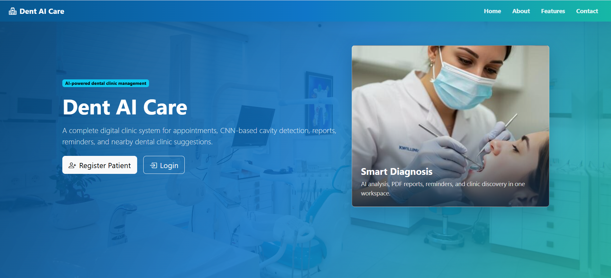
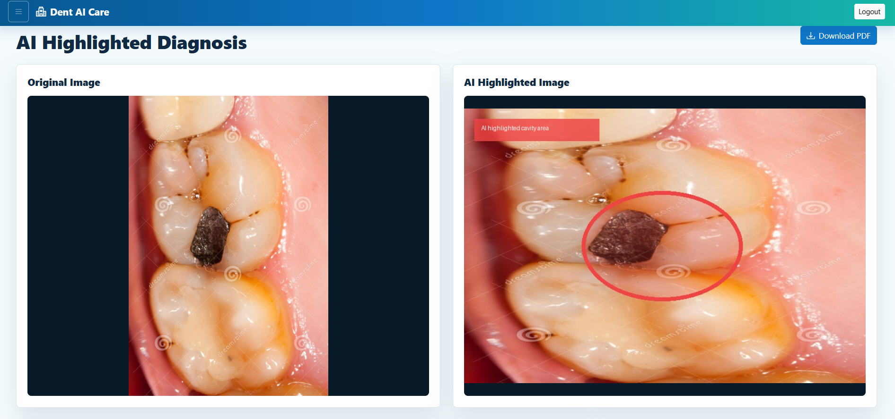
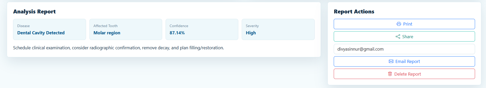
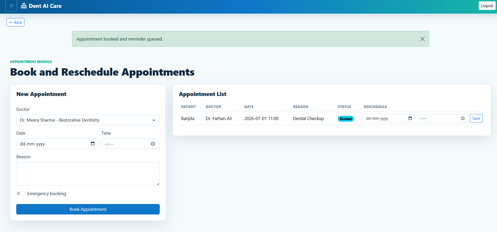
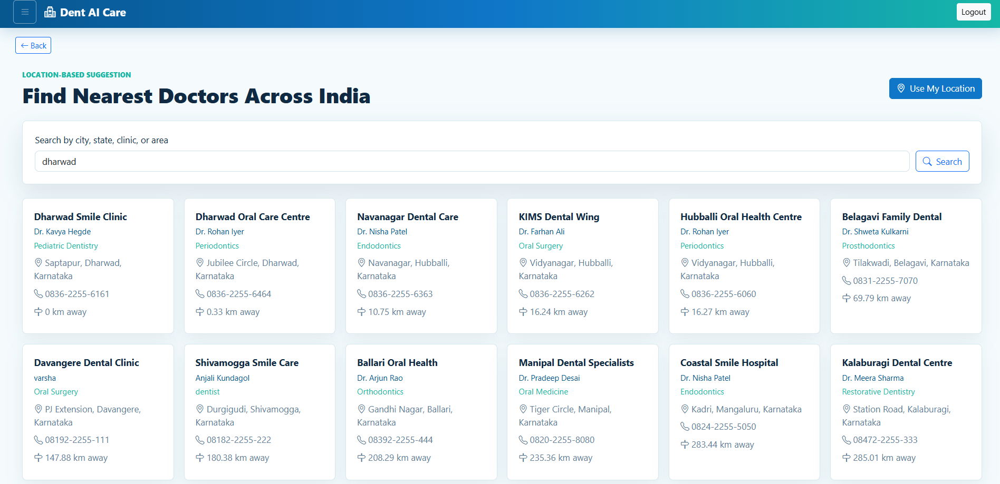

# 🦷 Dent AI Care

An AI-powered Digital Dental Clinic Management System developed as a BCA Final Year Project using **Python, Flask, TensorFlow/Keras, HTML, CSS, JavaScript, and SQLite**.

This application helps patients detect dental cavities from dental images using a CNN-based Machine Learning model while providing complete dental clinic management features.

---

## 📖 Project Overview

Dent AI Care is a web-based application that combines Artificial Intelligence and Clinic Management into one platform. It allows patients to upload dental X-ray or oral images, predicts dental cavities using a trained CNN model, and provides a detailed diagnosis report.

Apart from AI prediction, the system also offers appointment booking, doctor-patient communication, PDF report generation, email notifications, and nearby dental clinic search.

---

## 🛠️ Technologies Used

- Python
- Flask
- HTML5
- CSS3
- JavaScript
- TensorFlow / Keras
- OpenCV
- NumPy
- SQLite
- Bootstrap

---

## ✨ Features

### 👤 Patient Module

- Patient Registration & Login
- Profile Management
- Upload Dental/X-ray Images
- AI-based Dental Cavity Detection
- View Prediction Percentage
- Download Diagnosis Report (PDF)
- Receive Reports through Email
- Share Reports via WhatsApp
- Book Doctor Appointment
- Emergency Appointment Booking
- Chat with Doctor
- Search Nearby Dental Clinics

---

### 👨‍⚕️ Doctor Module

- Doctor Login
- View Patient Details
- View AI Prediction Results
- Reply to Patient Messages
- Manage Appointments

---

### 🔐 Admin Module

- Admin Login
- Manage Patients
- Manage Doctors
- View Appointment Details
- Monitor System Activities

---

### 🤖 AI Features

- CNN-based Dental Cavity Detection
- Confidence Score Prediction
- Affected Tooth Area Highlighting
- Original vs Predicted Image Visualization
- Treatment Recommendation

---

## 📂 Project Structure

```text
DentAI/
│
├── app/
│   ├── static/
│   │   ├── css/
│   │   └── js/
│   ├── templates/
│   ├── uploads/
│   ├── highlights/
│   ├── reports/
│   ├── ai_service.py
│   ├── models.py
│   ├── report_service.py
│   └── routes.py
│
├── dataset/
│   ├── cavity/
│   └── normal/
│
├── models/
│
├── train_model.py
├── run.py
├── requirements.txt
└── README.md
```

---

## ⚙️ Installation

### Clone the Repository

```bash
git clone https://github.com/your-username/Dent-AI-Care.git
```

### Create Virtual Environment

```bash
python -m venv .venv
```

### Activate Environment

#### Windows

```bash
.venv\Scripts\activate
```

#### Linux / Mac

```bash
source .venv/bin/activate
```

### Install Dependencies

```bash
pip install -r requirements.txt
```

---

## ▶️ Run the Application

```bash
python run.py
```

Open your browser and visit:

```
http://127.0.0.1:5000
```

---

## 🧠 Train the AI Model

Arrange your dataset as:

```text
dataset/
    cavity/
    normal/
```

Train the CNN model:

```bash
python train_model.py
```

The trained model will be stored in:

```text
models/dent_cavity_cnn.keras
```

---

## 📸 Screenshots

### 🏠 Home Page



### 🤖 AI Prediction



### 📊 Prediction Result



### 📅 Appointment Booking



### 📍 Nearby Dental Clinic Search



---

## 📦 Requirements

Install all required packages using:

```bash
pip install -r requirements.txt
```

---

## 🚀 Future Enhancements

- Video Consultation
- Online Payment Gateway
- Cloud Database
- Mobile Application
- Multi-language Support
- AI Treatment Suggestions

---

## 📌 Final Year Project

This project was developed as a **Bachelor of Computer Applications (BCA) Final Year Project** to demonstrate the practical implementation of Artificial Intelligence, Machine Learning, Web Development, and Database Management in healthcare.

**Note:** This system is intended for educational and demonstration purposes. AI predictions should support—not replace—a professional dentist's diagnosis.

---

## 👩‍💻 Author

**Divya Sinnur**

BCA Graduate

Aspiring Software Developer | Python Developer | Machine Learning Enthusiast

---

⭐ **If you found this project useful, please consider giving it a Star!**
